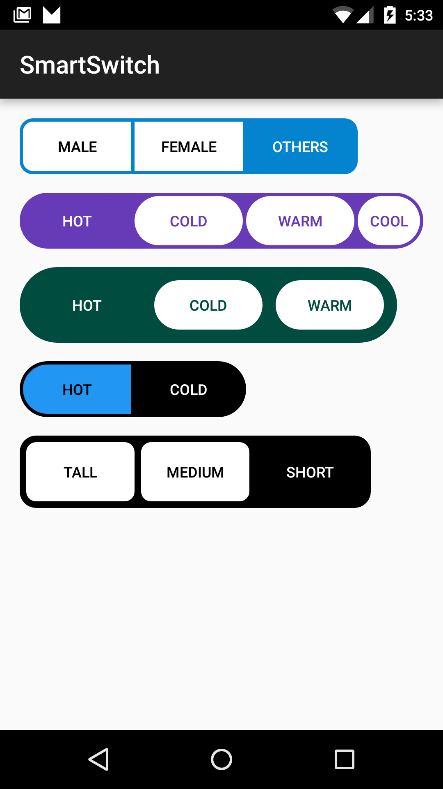

# Smart-Switch
Android multi choice switch view (Used this in my project, hope you find it useful)
  

<h1>Features</h1>
<ol style="list-style:decimal">
  <li>Two Styles, Box or Round</li>
  <li>Border Color</li>
  <li>Corner Radius</li>
  <li>Full Color Customizable</li>
</ol>
<h3>Usage</h3>
<ul style="list-style:decimal">
  <li>In XML Layout </li>
  <code>&lt;com.tmagic.smartswitch.Switch</code> 
  <code>android:id="@+id/switch_me"</code> 
  <code>android:layout_width="wrap_content"</code>  
  <code>android:layout_centerHorizontal="true"</code>  
  <code>android:layout_centerVertical="true"</code> 
  <code>android:layout_height="wrap_content"</code> 
  <code>app:activeColor="@color/blue"</code> 
  <code>app:activeTextColor="#fff"</code> 
  <code>app:inActiveColor="#fff"</code> 
  <code>app:inactiveTextColor="#000"</code> 
  <code>app:cornerRadius="6"</code> 
  <code>app:strokeWidth="2"&gt;</code> 
  Just add your buttons here according to your specifications
  
<code>&lt;/com.tmagic.smartswitch.Switch&gt;</code>

  
  <li>Programatically</li>
  <code>Switch newSwitch = new Switch(this);</code> 
  <code>Button optionTall = new Button(this);</code> 
  <code>Button optionShort = new Button(this);</code> 
  <code>Button optionMedium = new Button(this);</code> 
  <code>optionTall.setText("Tall");</code> 
  <code>optionShort.setText("Short");</code> 
  <code>optionMedium.setText("Medium");</code> 
  <code>newSwitch.addView(optionTall);</code> 
  <code>newSwitch.addView(optionMedium);</code> 
  <code>newSwitch.addView(optionShort);</code> 
  <code>newSwitch.setStyle(Switch.STYLE.ROUND);</code> 
  <code>newSwitch.setActiveColor(getResources().getColor(R.color.black));</code> 
  <code>newSwitch.setInActiveColor(getResources().getColor(R.color.white));</code> 
  <code>newSwitch.setActiveTextColor(getResources().getColor(R.color.white));</code> 
  <code>newSwitch.setInactiveTextColor(getResources().getColor(R.color.black));</code> 
  <code>newSwitch.setSelectedIndex(2);</code> 

  
</ul>

